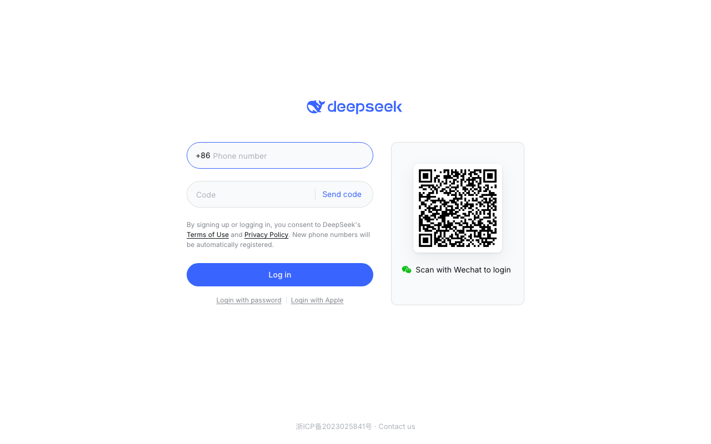
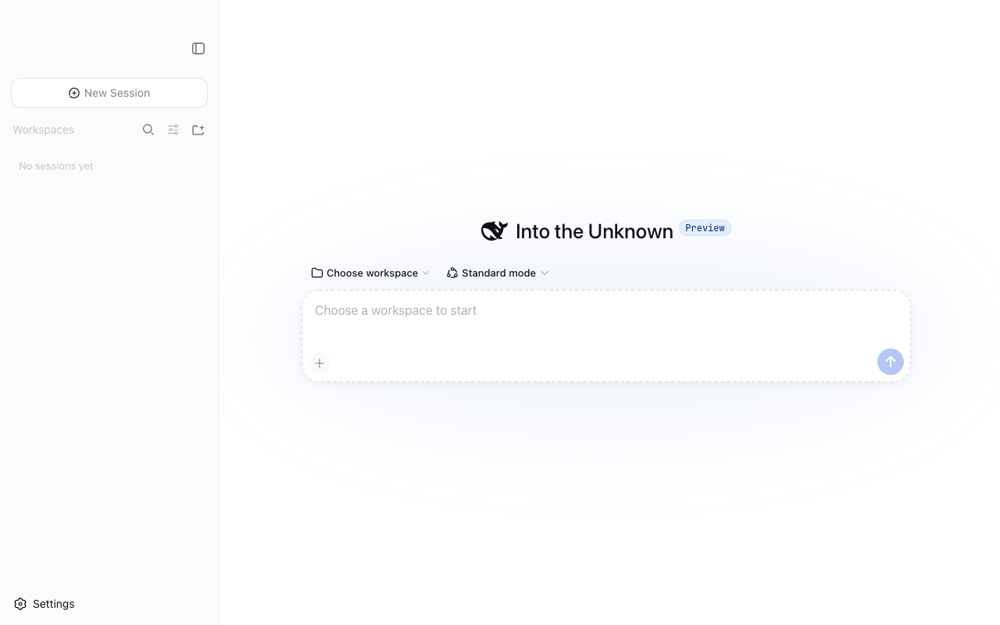

# DeepSeek Desktop

[English](README.md) | 中文

DeepSeek Desktop 将本地 DeepSeek Harness Web UI 与 [DeepSeek Chat 官方网页](https://chat.deepseek.com/) 集成到同一个原生桌面窗口中。用户可以通过标题栏切换 `Chat` 与 `Harness`，同时保持两个模式的账户、对话、凭据和存储彼此独立。

> 本项目是基于 DeepSeek Harness 构建的社区桌面项目，并非 DeepSeek 官方产品，也不会绕过官方网站的登录、WAF 或嵌入策略。

## 截图

### Chat 模式

Chat 模式在隔离且持久的浏览器分区中打开 DeepSeek 官方网页。截图展示的是未登录入口；用户可以通过网站自身的界面完成登录。



### Harness 模式

Harness 模式运行本地 Web UI，并提供工作区侧栏、会话列表和 agent（智能体）输入区。



## 主要功能

- **一个窗口提供两种模式。** Chat 与 Harness 是相互独立的保留视图，通过原生标题栏直接切换。
- **嵌入官方 Chat。** Chat 直接加载 `https://chat.deepseek.com/`，认证信息保存在独立的 Electron 分区中，不会成为 Harness 模型提供方。
- **本地 Harness 运行时。** Harness 启动并监管本地 Host、Web UI、会话、工作区、工具和 agent（智能体）配置。
- **状态彼此隔离。** 两种模式不共享 Cookie、凭据、对话、附件、提示词或导航状态。
- **主题同步。** 亮色、暗色和系统主题会在两种模式之间同步，同时保留各自页面的渲染实现。
- **原生桌面行为。** macOS 与 Windows 使用适配平台的标题栏控件；macOS 侧栏几何会避开模式切换器，不发生遮挡。
- **MIT 许可证。** 仓库包含 MIT 许可证；第三方包继续保留各自的许可证声明。

## 平台支持

当前桌面组合支持：

- macOS Apple Silicon（`arm64`），已在本地验证。
- Windows（`x64`），由 Electron Builder 配置负责打包。
- GitHub Releases 会为每个桌面版本标签提供未签名的 macOS `arm64` DMG/ZIP 和 Windows `x64` NSIS/ZIP 产物。

底层 Harness Web UI 仍可在 Linux 上运行，但原生桌面打包目前不以 Linux 为发布目标。发布产物未签名；平台签名和公证所需的凭据见[桌面发布指南](apps/desktop/README.md#signed-macos-dmg)。

## 环境要求

- Node.js `^22.19.0` 或 `>=24.0.0`
- pnpm `11.7.0`
- Harness 发起模型请求时，需要根据所选 profile 提供 DeepSeek API key。
- 用于 Electron 开发或打包的受支持桌面系统。

<a id="run"></a>

## 从源码运行

```sh
pnpm install
pnpm run dev:desktop
```

开发命令会先构建所需的 Host、client、Web 和 Electron 层，然后打开桌面应用。首次选择 Chat 时会打开官方网站，用户可以按网站流程完成登录。

## 构建桌面产物

```sh
pnpm run package:desktop
```

打包命令会构建应用、暂存 Host 运行时依赖树，并为当前平台创建未签名的应用目录。macOS 签名分发所需的凭据和流程见[桌面发布指南](apps/desktop/README.md#signed-macos-dmg)。

## 下载发布版本

推送一个版本与 `apps/desktop/package.json` 一致的 `vX.Y.Z` 标签即可启动桌面发布 workflow。GitHub Actions 会构建未签名的 macOS Apple Silicon 和 Windows x64 产物，并将它们附加到 GitHub Release。最新文件可从 [Releases 页面](https://github.com/zcx960/deepseek-desktop/releases)下载。

## 仓库结构

```text
apps/desktop/       Electron application, native shell, and dual-mode controller
apps/web/           Harness Web frontend
packages/           Harness and client plugin workspaces
assets/screenshots/ README screenshots
docs/               Architecture, testing, and contributor documentation
vendor/             Pinned Cordis source
```

Harness 的核心架构和插件约定仍由上游 [deepseek-ai/deepseek-harness](https://github.com/deepseek-ai/deepseek-harness) 项目负责。本仓库增加桌面组合和平台集成。

## 参与贡献

修改仓库前请阅读 [AGENTS.md](AGENTS.md) 和[开发指南](docs/development.md)。桌面范围的聚焦检查包括：

```sh
pnpm --filter @deepseek-ai/dsh-desktop run typecheck
pnpm --filter @deepseek-ai/dsh-desktop run test:electron
pnpm run build:desktop
```

请不要提交生成的 `lib/`、`dist/`、`runtime-host/`、`node_modules/` 或 Playwright 输出目录。

## 许可证

本项目按照 [MIT License](LICENSE) 开源。

DeepSeek 与 DeepSeek Chat 是其各自所有者的商标和服务。嵌入官方网站仍须遵守网站当前的服务条款和技术策略。
